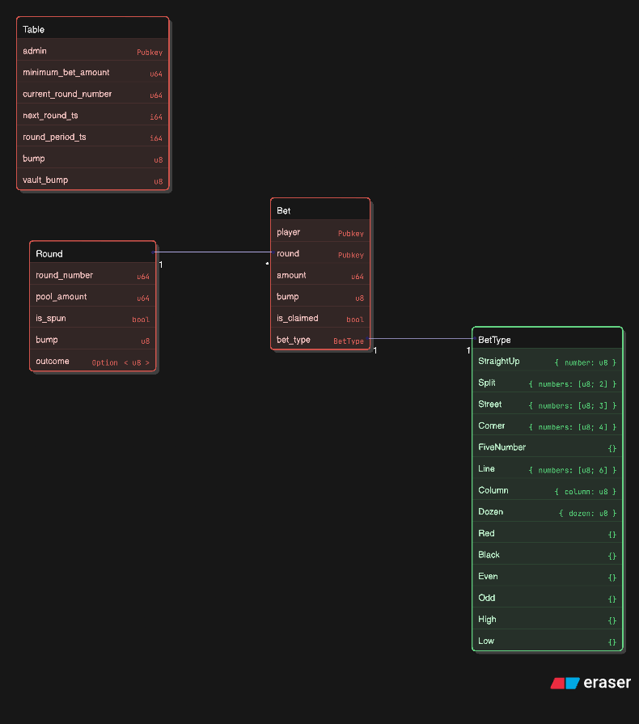
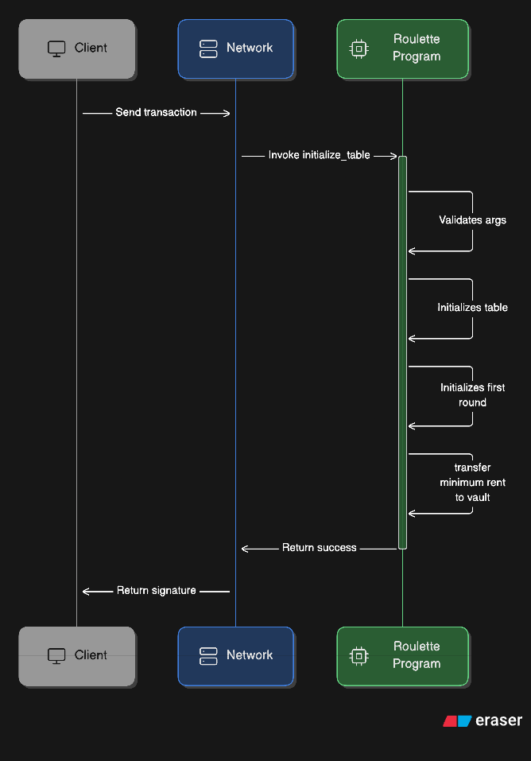
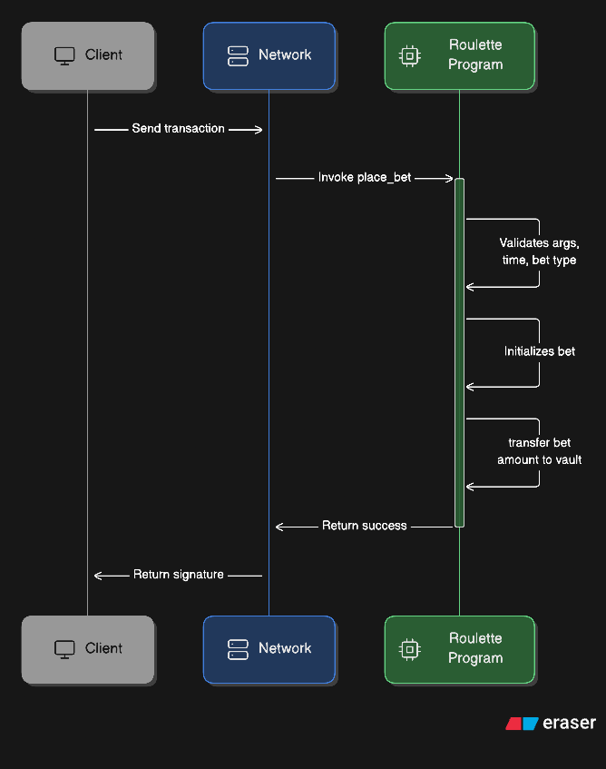
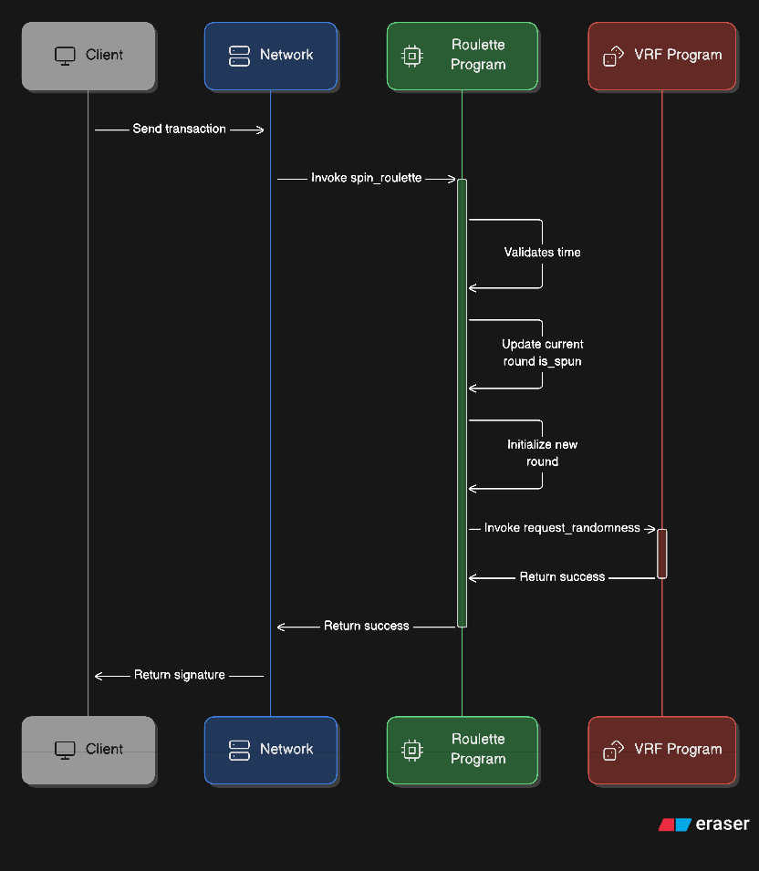
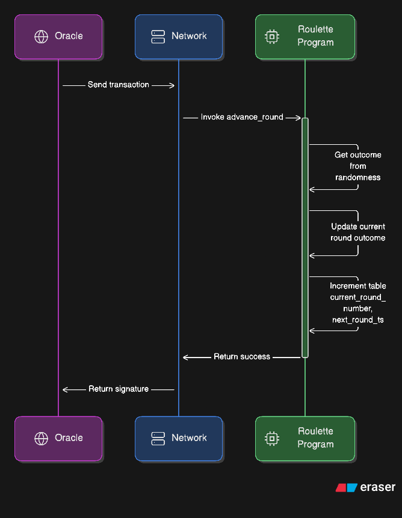
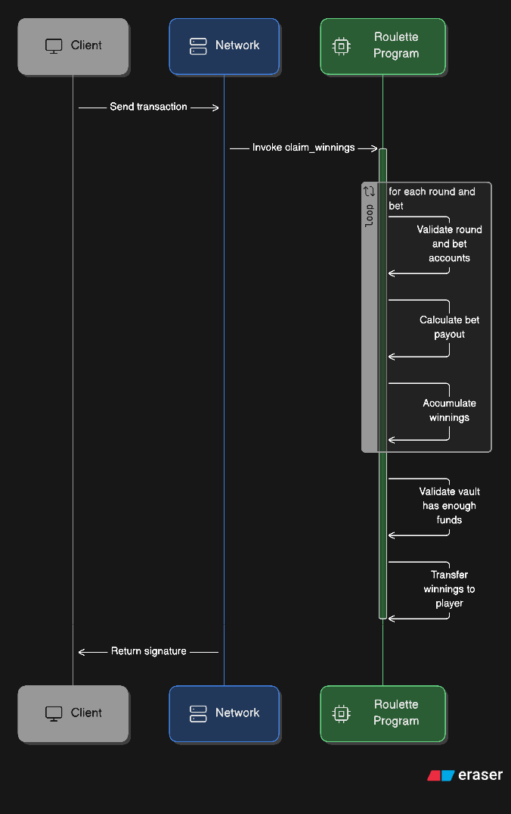
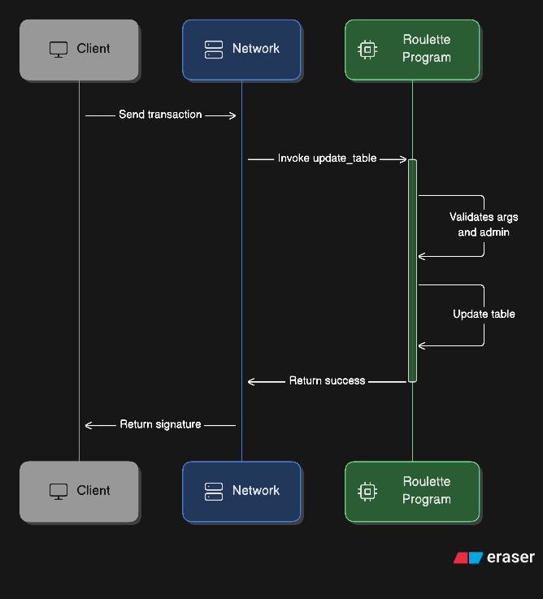
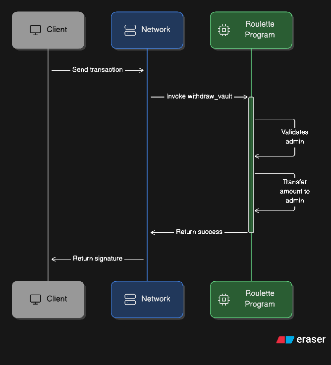

# Magic Roulette

Perpetual roulette game for [Turbin3 Accelerated Builders Cohort](https://turbin3.org/).

[Source Repository](https://github.com/Turbin3/accel-MagicRoulette)

## Built With

### Languages

- [](https://www.rust-lang.org/)
- [](https://www.typescriptlang.org/)
- [](https://react.dev/)

### Test Runner

- [](https://bun.sh/)

## Architecture Diagram

### Account Relationship Diagram



### Initialize Table



### Place Bet



### Spin Roulette



### Advance Round



### Claim Winnings



### Update Table



### Withdraw Vault



## Getting Started

### Prerequisites

1. Update your Solana CLI, avm and Bun toolkit

```bash
agave-install init 2.1.0
avm use 0.31.1
bun upgrade
```

### Setup

1. Clone repository

```bash
git clone https://github.com/Turbin3/accel-MagicRoulette.git
```

2. Install dependencies

```bash
bun i
```

3. Configure .env file

```bash
cp .env.example .env
```

#### Program

1. Resync your program ID

```bash
anchor keys sync
```

2. Build program

```bash
anchor build
```

#### Deployment

1. Create and fund keypair

```bash
solana-keygen new -o magic-roulette-wallet.json
```

> [!NOTE]  
> About 5 SOL is required for program deployment and funding accounts used in testing, which will be defunded at the end of every test.

2. Deploy program

```bash
bun run deploy
```

3. Optionally initialize IDL

```bash
bun run idl:init
```

#### Testing

Run tests against devnet cluster. Requires program to be first deployed.

```bash
bun run test
```

> [!NOTE]  
> Run `bun run reset; bun run test` to run 'hot-reloading' tests.

## Issues

View the [open issues](https://github.com/ChiefWoods/magic-roulette/issues) for a full list of proposed features and known bugs.

## Acknowledgements

### Resources

- [Shields.io](https://shields.io/)

### Hosting and API

- [Vercel](https://vercel.com/)
- [Helius](https://www.helius.dev/)
- [Sanctum Gateway](https://gateway.sanctum.so/)
- [MagicBlock](https://www.magicblock.xyz/)

## Contact

[chii.yuen@hotmail.com](mailto:chii.yuen@hotmail.com)